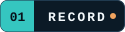
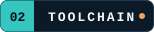
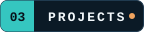
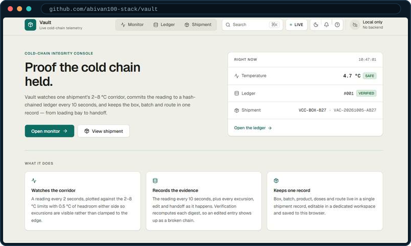
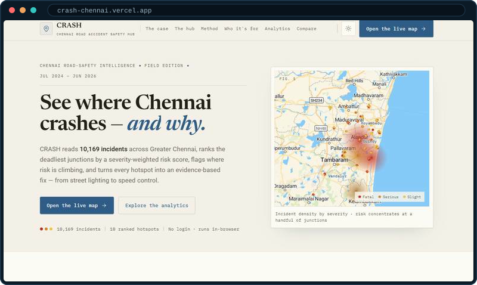
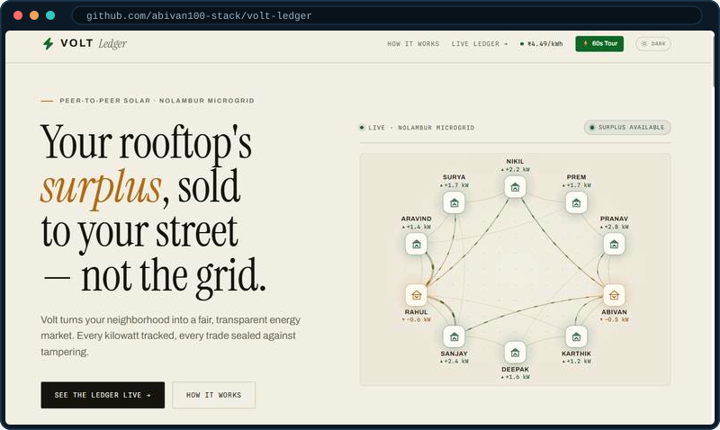
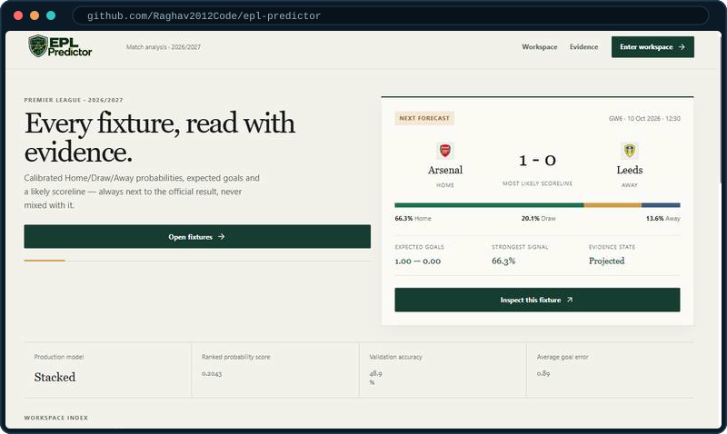

<table width="100%">
<tr>
<td width="150" align="center" valign="middle"> grown from commits</td>
<td valign="middle">
<b>Name</b> &nbsp; Raghav Krishna 
<b>Age</b> &nbsp; 14, Class 9 
<b>Based</b> &nbsp; Chennai, India 
<b>Role</b> &nbsp; Lead of my school's robotics team 
<b>Builds</b> &nbsp; ESP32 hardware, ML pipelines, web apps 
<b>Workflow</b> &nbsp; Pairs with coding agents to ship faster 
<b>Owns</b> &nbsp; Everything that touches the hardware  
 
</td>
</tr>
</table>

<h2></h2>

<table width="100%">
<tr><th align="left" width="30%">Result</th><th align="left" width="40%">Event</th><th align="left" width="30%">Project</th></tr>
<tr><td>&nbsp; <b>Won</b></td><td>RIRC 2026</td><td>HingeGuard</td></tr>
<tr><td>&nbsp; <b>Won</b></td><td>PEC Hacks 4.0</td><td><a href="https://github.com/abivan100-stack/vault">Vault</a></td></tr>
<tr><td>&nbsp; <b>Top 5</b></td><td>ZRC Technoxian 2026</td><td><a href="https://crash-chennai.vercel.app">CRASH</a></td></tr>
<tr><td>&nbsp; <b>Qualified</b></td><td>NRC, Noida</td><td><a href="https://crash-chennai.vercel.app">CRASH</a></td></tr>
<tr><td>&nbsp; <b>Participated</b></td><td>Shark Tank Challenge 2026</td><td><a href="https://github.com/abivan100-stack/volt-ledger">Volt</a></td></tr>
</table>

<h2></h2>

<table width="100%">
<tr>
<td width="50%" valign="top"><b>Embedded and 3D</b> </td>
<td width="50%" valign="top"><b>Web</b> </td>
</tr>
<tr>
<td width="50%" valign="top"><b>Data and backend</b> </td>
<td width="50%" valign="top"><b>Tools and AI</b> </td>
</tr>
</table>

<h2></h2>

<table width="100%">
<tr>
<td width="50%" valign="top">
 
<b>Vault</b> 
&nbsp; <b>Won</b> PEC Hacks 4.0 
Vaccine cold chain ledger with verifiable entries. Readings are simulated, and an edited entry breaks the hash chain. 
Aug 2026. React, TypeScript. 
<a href="https://github.com/abivan100-stack/vault">Code</a>
</td>
<td width="50%" valign="top">
 
<b>CRASH</b> 
&nbsp; <b>Top 5</b> ZRC Technoxian 2026, qualified for NRC 
Ranks Chennai's deadliest junctions from 10,169 recorded incidents and proposes an intervention for each. 
Jul 2026. JavaScript, Python. 
<a href="https://crash-chennai.vercel.app">Live demo</a> &nbsp;·&nbsp; <a href="https://github.com/abivan100-stack/C.R.A.S.H">Code</a>
</td>
</tr>
<tr>
<td width="50%" valign="top">
 
<b>Volt</b> 
&nbsp; <b>Participated</b> Shark Tank Challenge 2026 
Peer-to-peer rooftop solar ledger. Neighbours trade surplus power, and every trade is SHA-256 chained in the browser. 
Jul 2026. TypeScript. 
<a href="https://github.com/abivan100-stack/volt-ledger">Code</a>
</td>
<td width="50%" valign="top">
 
<b>EPL Predictor</b> 
Calibrated match forecasts from a stacked ensemble, with the production model picked by ranked probability score. 
Sep 2026. Python, TypeScript. 
<a href="https://github.com/Raghav2012Code/epl-predictor">Code</a>
</td>
</tr>
</table>

<h2></h2>

<table width="100%">
<tr><th align="left" width="14%">Project</th><th align="left">What it is</th><th align="left" width="20%">Links</th></tr>
<tr><td><b>urbania</b></td><td>2D top-down city simulator in C++ and raylib. Build roads, zone districts and watch citizens find jobs.</td><td><a href="https://github.com/Raghav2012Code/urbania">Code</a></td></tr>
<tr><td><b>saas-lab</b></td><td>Interactive SaaS financial modelling tool for calculating metrics and projecting growth.</td><td><a href="https://saas-lab-ten.vercel.app">Live</a>   <a href="https://github.com/Raghav2012Code/saas-lab">Code</a></td></tr>
</table>

 

The bonsai is grown from my commit history by [git-bonsai](https://github.com/egorthinks/git-bonsai) and regrown every day.

