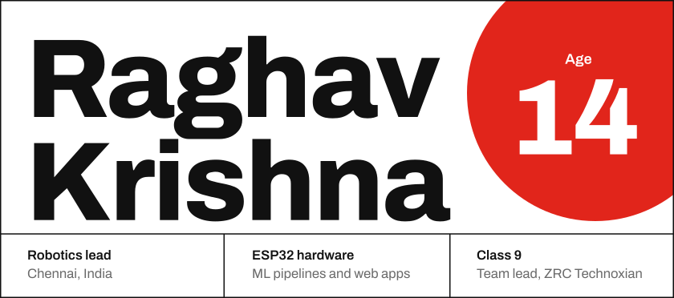 
<a href="https://raghavkrishna-dev.vercel.app">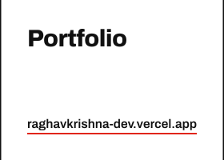</a><a href="https://x.com/raghav7krishna">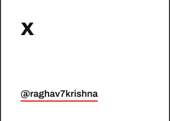</a> 
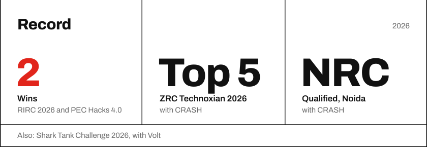 
 
<a href="https://github.com/abivan100-stack/vault">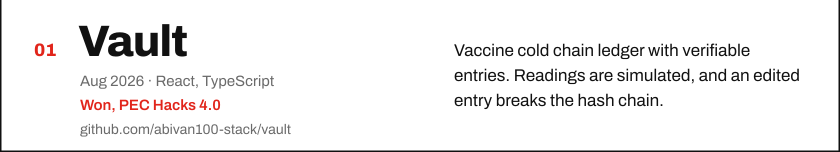</a> 
<a href="https://github.com/abivan100-stack/C.R.A.S.H">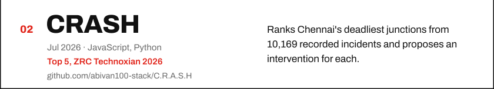</a> 
<a href="https://github.com/abivan100-stack/volt-ledger">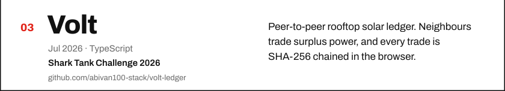</a> 
<a href="https://github.com/Raghav2012Code/epl-predictor">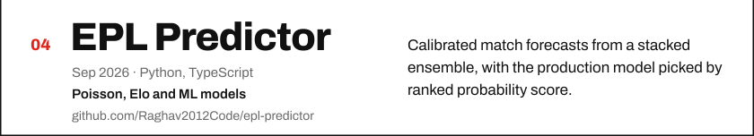</a> 
<a href="https://github.com/Raghav2012Code/urbania">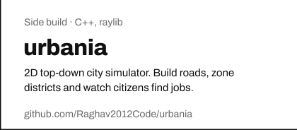</a><a href="https://github.com/Raghav2012Code/saas-lab">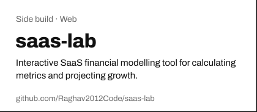</a> 
 
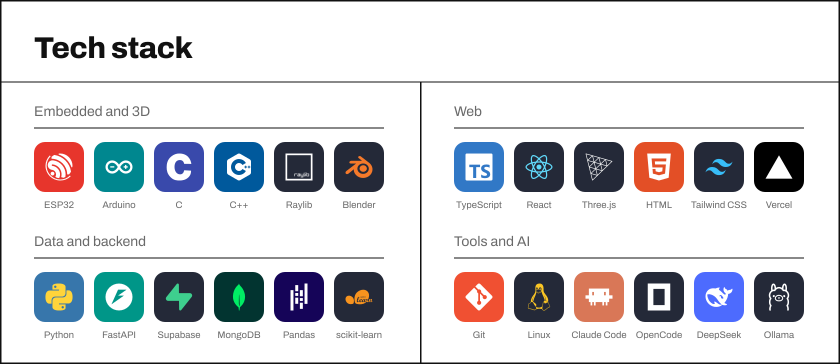

The bonsai is grown from my commit history by <a href="https://github.com/egorthinks/git-bonsai">git-bonsai</a> and regrown every day.

