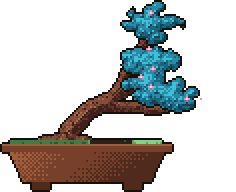

# Raghav Krishna

<picture></picture><!-- bonsai: pin WIDTH, never height. git-bonsai trees change aspect ratio with style
     (formal 92x109 tall vs slanted 118x96 wide); pinning height stretched the slanted
     tree to 288px and broke the layout.
     <picture> is also required: GitHub injects height:auto on bare .
     The   after the results row keeps later sections under the float. -->
<picture></picture>

**Robotics lead. I build ESP32 hardware, ML pipelines and web apps.**

I'm a 14-year-old in Class 9 in Chennai, and I lead my school's robotics team. I pair with coding agents to ship faster, and I own everything that touches the hardware.

[Portfolio](https://raghavkrishna-dev.vercel.app) &nbsp;&nbsp; [X](https://x.com/raghav7krishna)

   [-1B2A33?labelColor=1F7A92&style=flat-square)](#july) 

## Shipped in 2026

### September

**[EPL Predictor](https://github.com/Raghav2012Code/epl-predictor)** 
Calibrated match forecasts from a stacked ensemble, with the production model picked by ranked probability score. 
Python, TypeScript. &nbsp; [Code](https://github.com/Raghav2012Code/epl-predictor)

### August

**[Vault](https://github.com/abivan100-stack/vault)** &nbsp;  
Vaccine cold chain ledger with verifiable entries. Readings are simulated, and an edited entry breaks the hash chain. 
React, TypeScript. &nbsp; [Code](https://github.com/abivan100-stack/vault)

### July

**[CRASH](https://github.com/abivan100-stack/C.R.A.S.H)** &nbsp;  
Ranks Chennai's deadliest junctions from 10,169 recorded incidents and proposes an intervention for each. Qualified for NRC (Noida). 
JavaScript, Python. &nbsp; [Live demo](https://crash-chennai.vercel.app) &nbsp; [Code](https://github.com/abivan100-stack/C.R.A.S.H)

**[Volt](https://github.com/abivan100-stack/volt-ledger)** &nbsp;  
Peer-to-peer rooftop solar ledger. Neighbours trade surplus power, and every trade is SHA-256 chained in the browser. 
TypeScript. &nbsp; [Code](https://github.com/abivan100-stack/volt-ledger)

## Stack

<b>Embedded and graphics</b> 
&nbsp;&nbsp;&nbsp;
&nbsp;&nbsp;&nbsp;
<a href="https://en.cppreference.com/w/c"><picture><source media="(prefers-color-scheme: dark)" srcset="https://cdn.simpleicons.org/c/A8B9CC"></picture></a>&nbsp;&nbsp;&nbsp;
<a href="https://isocpp.org/"><picture><source media="(prefers-color-scheme: dark)" srcset="https://cdn.simpleicons.org/cplusplus/1a6aa6"></picture></a>&nbsp;&nbsp;&nbsp;
<a href="https://www.raylib.com/"><picture><source media="(prefers-color-scheme: dark)" srcset="https://cdn.simpleicons.org/raylib/e6edf3"></picture></a>&nbsp;&nbsp;&nbsp;
<a href="https://www.blender.org/"><picture><source media="(prefers-color-scheme: dark)" srcset="https://cdn.simpleicons.org/blender/E87D0D"></picture></a>

<b>Web</b> 
&nbsp;&nbsp;&nbsp;
<a href="https://react.dev/"><picture><source media="(prefers-color-scheme: dark)" srcset="https://cdn.simpleicons.org/react/61DAFB"></picture></a>&nbsp;&nbsp;&nbsp;
&nbsp;&nbsp;&nbsp;
<a href="https://www.w3.org/TR/CSS/"><picture><source media="(prefers-color-scheme: dark)" srcset="https://cdn.simpleicons.org/css/7d52a8"></picture></a>&nbsp;&nbsp;&nbsp;
<a href="https://vercel.com/"><picture><source media="(prefers-color-scheme: dark)" srcset="https://cdn.simpleicons.org/vercel/e6edf3"></picture></a>

<b>Data and backend</b> 
&nbsp;&nbsp;&nbsp;
&nbsp;&nbsp;&nbsp;
<a href="https://supabase.com/"><picture><source media="(prefers-color-scheme: dark)" srcset="https://cdn.simpleicons.org/supabase/3FCF8E"></picture></a>&nbsp;&nbsp;&nbsp;
&nbsp;&nbsp;&nbsp;
<a href="https://pandas.pydata.org/"><picture><source media="(prefers-color-scheme: dark)" srcset="https://cdn.simpleicons.org/pandas/73689b"></picture></a>&nbsp;&nbsp;&nbsp;
<a href="https://scikit-learn.org/"><picture><source media="(prefers-color-scheme: dark)" srcset="https://cdn.simpleicons.org/scikitlearn/F7931E"></picture></a>

<b>Tools and AI</b> 
&nbsp;&nbsp;&nbsp;
<a href="https://www.kernel.org/"><picture><source media="(prefers-color-scheme: dark)" srcset="https://cdn.simpleicons.org/linux/FCC624"></picture></a>&nbsp;&nbsp;&nbsp;
<a href="https://claude.com/product/claude-code"><picture><source media="(prefers-color-scheme: dark)" srcset="https://cdn.simpleicons.org/claudecode/D97757"></picture></a>&nbsp;&nbsp;&nbsp;
<a href="https://opencode.ai/"><picture><source media="(prefers-color-scheme: dark)" srcset="https://cdn.simpleicons.org/opencode/e6edf3"></picture></a>&nbsp;&nbsp;&nbsp;
&nbsp;&nbsp;&nbsp;
<a href="https://ollama.com/"><picture><source media="(prefers-color-scheme: dark)" srcset="https://cdn.simpleicons.org/ollama/e6edf3"></picture></a>

---

The bonsai is grown from my commit history by [git-bonsai](https://github.com/egorthinks/git-bonsai) and regrown every day.

