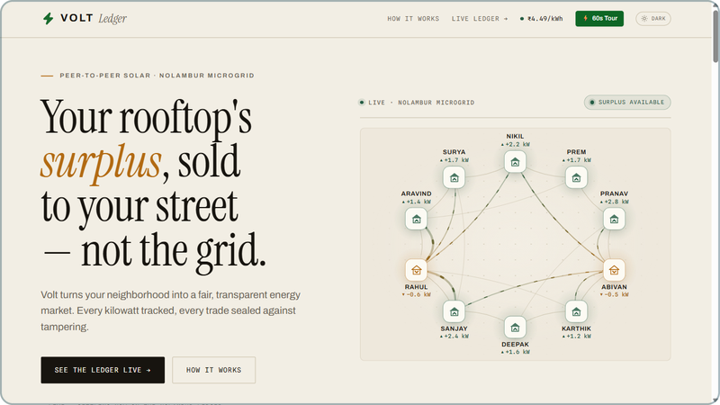
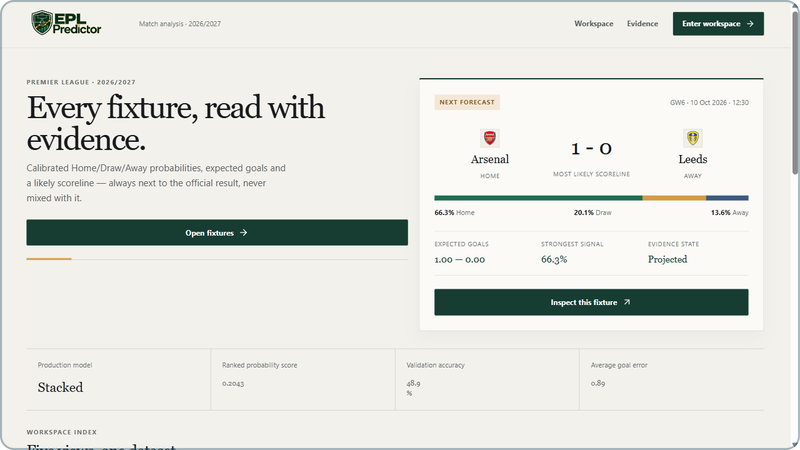

# Raghav Krishna

**Robotics lead. I build ESP32 hardware, ML pipelines and web apps.**

I'm a 14-year-old in Class 9 in Chennai, and I lead my school's robotics team. I pair with coding agents to ship faster, and I own everything that touches the hardware.

&nbsp; **Won** RIRC 2026, HingeGuard 
&nbsp; **Won** PEC Hacks 4.0, Vault 
&nbsp; **Top 5** ZRC Technoxian 2026, CRASH 
&nbsp; **Qualified** NRC (Noida) 
&nbsp; **Participated** Shark Tank Challenge 2026, Volt

[Portfolio](https://raghavkrishna-dev.vercel.app) &nbsp;&nbsp; [X](https://x.com/raghav7krishna)

<picture></picture><!-- bonsai: pin WIDTH, never height. git-bonsai trees change aspect ratio with style
     (formal 92x109 tall vs slanted 118x96 wide); pinning height stretched the slanted
     tree to 288px and broke the layout.
     <picture> is also required: GitHub injects height:auto on bare .
     The   after the stack keeps the next section under the float. -->
<picture></picture>

<b>Embedded and 3D</b> 

<b>Web</b> 

<b>Data and backend</b> 

<b>Tools and AI</b> 
 

## Work

<picture></picture>

### Vault

&nbsp; **Won** PEC Hacks 4.0 
Vaccine cold chain ledger with verifiable entries. Readings are simulated, and an edited entry breaks the hash chain. 
Aug 2026. React, TypeScript. &nbsp; [Code](https://github.com/abivan100-stack/vault) 

<picture></picture>

### CRASH

&nbsp; **Top 5** ZRC Technoxian 2026, qualified for NRC (Noida) 
Ranks Chennai's deadliest junctions from 10,169 recorded incidents and proposes an intervention for each. 
Jul 2026. JavaScript, Python. &nbsp; [Live demo](https://crash-chennai.vercel.app) &nbsp; [Code](https://github.com/abivan100-stack/C.R.A.S.H) 

<picture></picture>

### Volt

&nbsp; **Participated** Shark Tank Challenge 2026 
Peer-to-peer rooftop solar ledger. Neighbours trade surplus power, and every trade is SHA-256 chained in the browser. 
Jul 2026. TypeScript. &nbsp; [Code](https://github.com/abivan100-stack/volt-ledger) 

<picture></picture>

### EPL Predictor

Calibrated match forecasts from a stacked ensemble, with the production model picked by ranked probability score. 
Sep 2026. Python, TypeScript. &nbsp; [Code](https://github.com/Raghav2012Code/epl-predictor) 

**Also built.** [urbania](https://github.com/Raghav2012Code/urbania) is a 2D top-down city simulator in C++ and raylib where you build roads, zone districts and watch citizens find jobs. [saas-lab](https://github.com/Raghav2012Code/saas-lab) ([live](https://saas-lab-ten.vercel.app)) is an interactive SaaS financial modelling tool for calculating metrics and projecting growth.

---

The bonsai is grown from my commit history by [git-bonsai](https://github.com/egorthinks/git-bonsai) and regrown every day.

