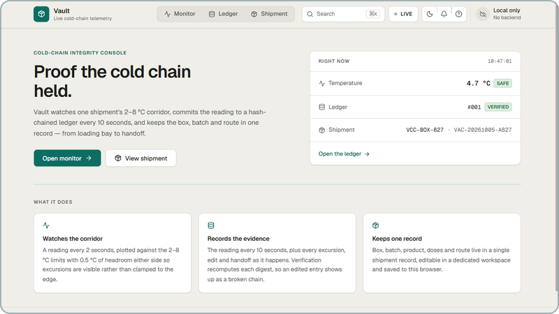
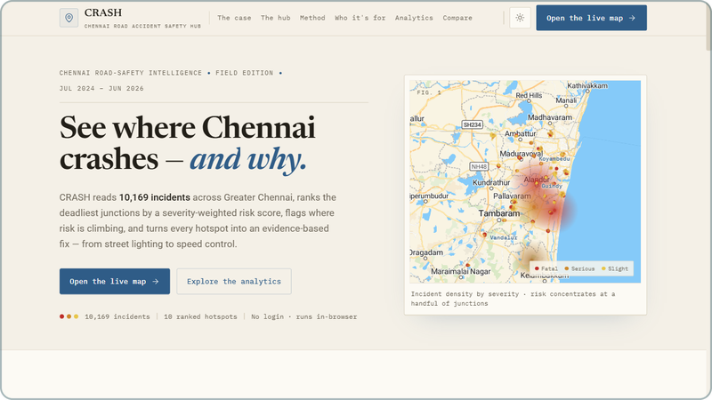

# Raghav Krishna

**Robotics lead. I build ESP32 hardware, ML pipelines and web apps.**

<picture><source media="(prefers-color-scheme: dark)" srcset="assets/results/won-rirc-dark.svg"></picture>&nbsp;
<picture><source media="(prefers-color-scheme: dark)" srcset="assets/results/won-pec-dark.svg"></picture>&nbsp;
<picture><source media="(prefers-color-scheme: dark)" srcset="assets/results/top5-zrc-dark.svg"></picture>&nbsp;
<picture><source media="(prefers-color-scheme: dark)" srcset="assets/results/qualified-nrc-dark.svg"></picture>

I'm a 14-year-old in Class 9 in Chennai, and I lead my school's robotics team. I pair with coding agents to ship faster, and I own everything that touches the hardware.

[Portfolio](https://raghavkrishna-dev.vercel.app) &nbsp;&nbsp; [X](https://x.com/raghav7krishna)

<picture></picture><!-- bonsai: pin WIDTH, never height. git-bonsai trees change aspect ratio with style
     (formal 92x109 tall vs slanted 118x96 wide); pinning height stretched the slanted
     tree to 288px and broke the layout.
     <picture> is also required: GitHub injects height:auto on bare .
     The <br clear="all"> after the stack keeps later sections under the float. -->
<picture></picture>

<p>
<picture><source media="(prefers-color-scheme: dark)" srcset="assets/stack/embedded-dark.svg"></picture><br />
<picture><source media="(prefers-color-scheme: dark)" srcset="assets/stack/web-dark.svg"></picture><br />
<picture><source media="(prefers-color-scheme: dark)" srcset="assets/stack/data-dark.svg"></picture><br />
<picture><source media="(prefers-color-scheme: dark)" srcset="assets/stack/tools-dark.svg"></picture><br clear="all" />
</p>

## Selected work

<table>
<tr>
<td valign="top" width="50%">
<a href="https://github.com/abivan100-stack/vault"></a><br />
<b>Vault</b><br />
<picture><source media="(prefers-color-scheme: dark)" srcset="assets/results/won-pec-dark.svg"></picture><br />
Vaccine cold chain ledger with verifiable entries. Readings are simulated, and an edited entry breaks the hash chain.<br />
<sub>Aug 2026. React, TypeScript.</sub><br />
<a href="https://github.com/abivan100-stack/vault">Code</a>
</td>
<td valign="top" width="50%">
<a href="https://crash-chennai.vercel.app"></a><br />
<b>CRASH</b><br />
<picture><source media="(prefers-color-scheme: dark)" srcset="assets/results/top5-zrc-dark.svg"></picture><br />
Ranks Chennai's deadliest junctions from 10,169 recorded incidents and proposes an intervention for each. Qualified for NRC (Noida).<br />
<sub>Jul 2026. JavaScript, Python.</sub><br />
<a href="https://crash-chennai.vercel.app">Live demo</a> &nbsp; <a href="https://github.com/abivan100-stack/C.R.A.S.H">Code</a>
</td>
</tr>
</table>

## Also built

- **[EPL Predictor](https://github.com/Raghav2012Code/epl-predictor)** (Sep 2026). Calibrated match forecasts from a stacked ensemble, with the production model picked by ranked probability score. Python, TypeScript.
- **[Volt](https://github.com/abivan100-stack/volt-ledger)** (Jul 2026). Peer-to-peer rooftop solar ledger where every trade is SHA-256 chained in the browser. Entered the Shark Tank Challenge 2026. TypeScript.
- **[urbania](https://github.com/Raghav2012Code/urbania)**. A 2D top-down city simulator in C++ and raylib: build roads, zone districts, watch citizens find jobs.
- **[saas-lab](https://github.com/Raghav2012Code/saas-lab)**. An interactive SaaS financial modelling tool for calculating metrics and projecting growth. [Live](https://saas-lab-ten.vercel.app).

## 2026 as a commit log

```text
* f427ad0 (HEAD -> main) Sep: EPL Predictor
* c811b22 (tag: won-pec-hacks-4.0) Aug: Vault
* 11719da (tag: top-5-nrc-qualifier) Jul: CRASH
* 73b5ff6 (tag: shark-tank-participant) Jul: Volt
```

<sub>Newest first, tags are results. Each hash is the first 7 characters of SHA-256 over the previous hash, a space and the text after the hash, starting from `0000000`. Edit any line and its hash and every hash above it change, the same idea as the ledgers in Vault and Volt.</sub>

---

<sub>The bonsai is grown from my commit history by [git-bonsai](https://github.com/egorthinks/git-bonsai) and regrown every day.</sub>


