<picture></picture><picture></picture><picture><source media="(prefers-color-scheme: dark)" srcset="assets/design/masthead-dark.svg"></picture>

Robotics lead &nbsp;·&nbsp; Age 14, Class 9 &nbsp;·&nbsp; Chennai, India 
**[Portfolio](https://raghavkrishna-dev.vercel.app)** &nbsp;·&nbsp; **[X](https://x.com/raghav7krishna)**

 

<picture><source media="(prefers-color-scheme: dark)" srcset="assets/design/record-dark.svg"></picture>

`WON` &nbsp;RIRC 2026, HingeGuard 
`WON` &nbsp;PEC Hacks 4.0, [Vault](https://github.com/abivan100-stack/vault) 
`TOP 5` &nbsp;ZRC Technoxian 2026, [CRASH](https://crash-chennai.vercel.app) 
`QUALIFIED` &nbsp;NRC, Noida 
`ENTERED` &nbsp;Shark Tank Challenge 2026, [Volt](https://github.com/abivan100-stack/volt-ledger)

 

<picture><source media="(prefers-color-scheme: dark)" srcset="assets/design/toolchain-dark.svg"></picture>

**Embedded and 3D** &nbsp; ESP32 · Arduino · C · C++ · Raylib · Blender 
**Web** &nbsp; TypeScript · React · HTML · CSS · Vercel 
**Data and backend** &nbsp; Python · FastAPI · Supabase · MongoDB · Pandas · scikit-learn 
**Tools and AI** &nbsp; Git · Linux · Claude Code · OpenCode · DeepSeek · Ollama

 

<picture><source media="(prefers-color-scheme: dark)" srcset="assets/design/projects-dark.svg"></picture>

<picture><source media="(prefers-color-scheme: dark)" srcset="assets/design/p-vault-dark.svg"></picture> 
`WON` &nbsp;PEC Hacks 4.0 
Vaccine cold chain ledger with verifiable entries. Readings are simulated, and an edited entry breaks the hash chain. 
Aug 2026 · React, TypeScript &nbsp;·&nbsp; [Code](https://github.com/abivan100-stack/vault)

 

<picture><source media="(prefers-color-scheme: dark)" srcset="assets/design/p-crash-dark.svg"></picture> 
`TOP 5` &nbsp;ZRC Technoxian 2026, qualified for NRC 
Ranks Chennai's deadliest junctions from 10,169 recorded incidents and proposes an intervention for each. 
Jul 2026 · JavaScript, Python &nbsp;·&nbsp; [Live demo](https://crash-chennai.vercel.app) &nbsp;·&nbsp; [Code](https://github.com/abivan100-stack/C.R.A.S.H)

 

<picture><source media="(prefers-color-scheme: dark)" srcset="assets/design/p-volt-dark.svg"></picture> 
`ENTERED` &nbsp;Shark Tank Challenge 2026 
Peer-to-peer rooftop solar ledger. Neighbours trade surplus power, and every trade is SHA-256 chained in the browser. 
Jul 2026 · TypeScript &nbsp;·&nbsp; [Code](https://github.com/abivan100-stack/volt-ledger)

 

<picture><source media="(prefers-color-scheme: dark)" srcset="assets/design/p-epl-dark.svg"></picture> 
Calibrated match forecasts from a stacked ensemble, with the production model picked by ranked probability score. 
Sep 2026 · Python, TypeScript &nbsp;·&nbsp; [Code](https://github.com/Raghav2012Code/epl-predictor)

 

<picture><source media="(prefers-color-scheme: dark)" srcset="assets/design/also-built-dark.svg"></picture>

**[urbania](https://github.com/Raghav2012Code/urbania)** &nbsp; 2D top-down city simulator in C++ and raylib. Build roads, zone districts and watch citizens find jobs. 
**[saas-lab](https://github.com/Raghav2012Code/saas-lab)** &nbsp; Interactive SaaS financial modelling tool for calculating metrics and projecting growth. [Live](https://saas-lab-ten.vercel.app)

 

The bonsai is grown from my commit history by [git-bonsai](https://github.com/egorthinks/git-bonsai) and regrown every day.

