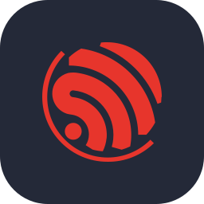
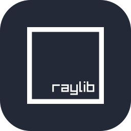
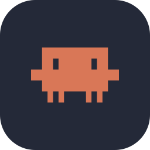

# Raghav Krishna

**Robotics lead. I build ESP32 hardware, ML pipelines and web apps.**

<picture></picture><!-- bonsai: pin WIDTH, never height. git-bonsai trees change aspect ratio with style
     (formal 92x109 tall vs slanted 118x96 wide); pinning height stretched the slanted
     tree to 288px and broke the layout.
     <picture> is also required: GitHub injects height:auto on bare .
     The   after the links line keeps the stack and later sections under the float. -->
<picture></picture>

I'm a 14-year-old in Class 9 in Chennai, and I lead my school's robotics team. I pair with coding agents to ship faster, and I own everything that touches the hardware.

[Portfolio](https://raghavkrishna-dev.vercel.app) &nbsp;&nbsp; [X](https://x.com/raghav7krishna) 

&nbsp;
&nbsp;
&nbsp;
&nbsp;
&nbsp;
&nbsp;
&nbsp;

&nbsp;
&nbsp;
&nbsp;
&nbsp;
&nbsp;
&nbsp;
&nbsp;
&nbsp;

&nbsp;
&nbsp;
&nbsp;
&nbsp;
&nbsp;

   [-1B2A33?labelColor=1F7A92&style=flat-square)](#july)

## Shipped in 2026

### September

**[EPL Predictor](https://github.com/Raghav2012Code/epl-predictor)** 
Calibrated match forecasts from a stacked ensemble, with the production model picked by ranked probability score. 
Python, TypeScript. &nbsp; [Code](https://github.com/Raghav2012Code/epl-predictor)

### August

**[Vault](https://github.com/abivan100-stack/vault)** &nbsp;  
Vaccine cold chain ledger with verifiable entries. Readings are simulated, and an edited entry breaks the hash chain. 
React, TypeScript. &nbsp; [Code](https://github.com/abivan100-stack/vault)

### July

**[CRASH](https://github.com/abivan100-stack/C.R.A.S.H)** &nbsp;  
Ranks Chennai's deadliest junctions from 10,169 recorded incidents and proposes an intervention for each. Qualified for NRC (Noida). 
JavaScript, Python. &nbsp; [Live demo](https://crash-chennai.vercel.app) &nbsp; [Code](https://github.com/abivan100-stack/C.R.A.S.H)

**[Volt](https://github.com/abivan100-stack/volt-ledger)** &nbsp;  
Peer-to-peer rooftop solar ledger. Neighbours trade surplus power, and every trade is SHA-256 chained in the browser. 
TypeScript. &nbsp; [Code](https://github.com/abivan100-stack/volt-ledger)

---

The bonsai is grown from my commit history by [git-bonsai](https://github.com/egorthinks/git-bonsai) and regrown every day.

