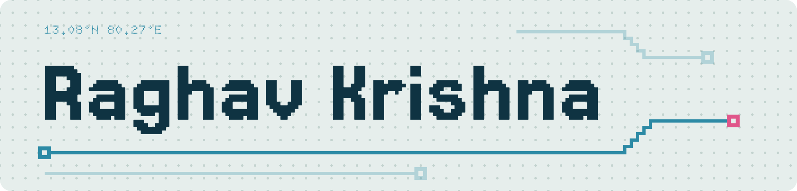

<picture>
  <source media="(prefers-color-scheme: dark)" srcset="assets/banner-dark.png">
  
</picture>

<picture></picture>

I'm a 14-year-old freshman (Class 9) in Chennai, and I lead my school's robotics team.

I build ESP32 hardware, ML pipelines, and deployed web apps. I pair with coding agents to ship faster, and I own everything that touches the hardware.

**[Portfolio](https://raghavkrishna-dev.vercel.app)** &nbsp;&nbsp; **[X](https://x.com/raghav7krishna)**

 

## Projects

<table>
<tr>
<td valign="top" width="50%">
 
<b>Volt</b> 
Peer-to-peer rooftop solar ledger. Neighbours trade surplus power, and every trade is SHA-256 chained in the browser. 
Shark Tank Challenge 2026, participated. Built Jul 2026. TypeScript. 
<a href="https://volt-ledger.vercel.app">Live demo</a> &nbsp; <a href="https://github.com/abivan100-stack/volt-ledger">Code</a>
</td>
<td valign="top" width="50%">
 
<b>Vault</b> 
Vaccine cold chain ledger with verifiable entries. Readings are simulated, and an edited entry breaks the hash chain. 
<b>Won</b> PEC Hacks 4.0. Built Aug 2026. React, TypeScript. 
<a href="https://github.com/abivan100-stack/vault">Code</a>
</td>
</tr>
</table>

<table>
<tr>
<td valign="top" width="50%">
 
<b>CRASH</b> 
Ranks Chennai's deadliest junctions from 10,169 recorded incidents and proposes an intervention for each. 
<b>Top 5</b> at ZRC Technoxian 2026, qualified for NRC (Noida). Built Jul 2026. JavaScript, Python. 
<a href="https://crash-chennai.vercel.app">Live demo</a> &nbsp; <a href="https://github.com/abivan100-stack/C.R.A.S.H">Code</a>
</td>
<td valign="top" width="50%">
 
<b>EPL Predictor</b> 
Calibrated match forecasts from a stacked ensemble, with the production model picked by ranked probability score. 
Built Sep 2026. Python, TypeScript. 
<a href="https://github.com/Raghav2012Code/epl-predictor">Code</a>
</td>
</tr>
</table>

## Competitions

| Event | Project | Result |
| :--- | :--- | :--- |
| RIRC 2026 | **HingeGuard** | **Won** |
| PEC Hacks 4.0 | [**Vault**](https://github.com/abivan100-stack/vault) | **Won** |
| ZRC Technoxian 2026 | [**CRASH**](https://github.com/abivan100-stack/C.R.A.S.H) | **Top 5**, qualified for NRC (Noida) |
| Shark Tank Challenge 2026 | [**Volt**](https://github.com/abivan100-stack/volt-ledger) | Participated |

## Stack

**Embedded** 
     

**Web** 
      

**Backend and data** 
     

**Workflow and AI tools** 
     

 

The bonsai is grown from my commit history by [git-bonsai](https://github.com/egorthinks/git-bonsai) and regrown every day.
