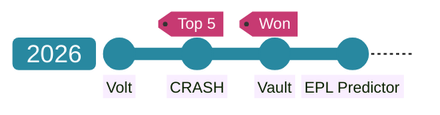
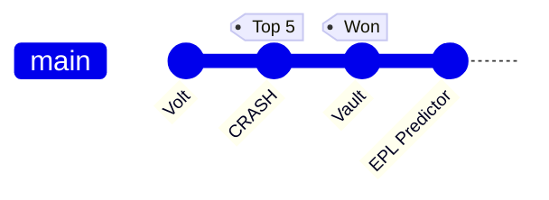
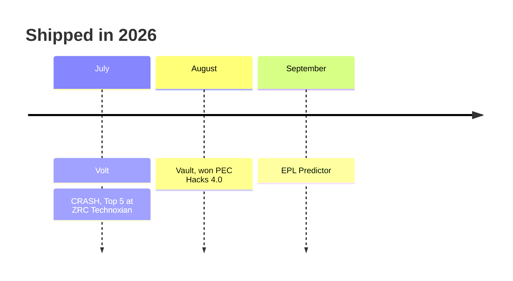

# mermaid test A (themed colours only)

```mermaid
%%{init: {'theme':'base','themeVariables':{'git0':'#2888A0','git1':'#C73A72','git2':'#A05838','git3':'#38C0D8','gitBranchLabel0':'#ffffff','gitBranchLabel1':'#ffffff','gitBranchLabel2':'#ffffff','gitBranchLabel3':'#ffffff','tagLabelColor':'#ffffff','tagLabelBackground':'#C73A72','tagLabelBorder':'#C73A72'},'gitGraph':{'mainBranchName':'2026','showCommitLabel':true,'rotateCommitLabel':false}}}%%
gitGraph
   commit id: "Volt"
   commit id: "CRASH" tag: "Top 5"
   commit id: "Vault" tag: "Won"
   commit id: "EPL Predictor"
```

# mermaid test B (default theme)

```mermaid
gitGraph
   commit id: "Volt"
   commit id: "CRASH" tag: "Top 5"
   commit id: "Vault" tag: "Won"
   commit id: "EPL Predictor"
```

# mermaid test C (timeline)

```mermaid
timeline
    title Shipped in 2026
    July : Volt : CRASH, Top 5 at ZRC Technoxian
    August : Vault, won PEC Hacks 4.0
    September : EPL Predictor
```
